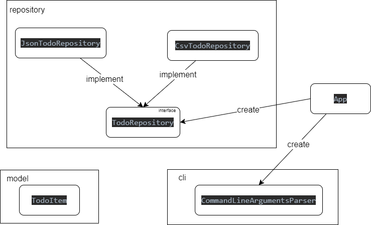

# L3 design pattern report

- **Firstname**: Nassim Arselan
- **Lastname**: Benhamed

Pour realiser mon architecture pour la todo-list, j'ai d'abord essayé de faire une structure similaire a votre exemple des list de teas (thés), 
mais au fur et à mesure je me suis perdu dans votre code j'avais beaucoup d'incertitudes au niveau de votre code, donc a la fin vu que je n'avais 
pas trop de temps j'ai essayer de dispatcher mon code, mais pour le temps qui me reste avant notre prochain cours j'essayerais de terminer les differentes 
interfaces et la partie service.

**TP3:**

j'ai divisé mon travail en 6 classes:
- CommandLineArgumentsParser: dans cet classe je vais parser les arguments reçus par la ligne de commande
et renvoyer une commandeLine 
- TodoItem: c'est ma classe model ou en trouve 2 attributs le nom de la todo et un bool de si la todo est 
fini ou pas encore
- TodoRepository: une interface avec 3 fonction (insert, findAll et getAllTodos)
- CsvTodoRepository: classe qui implemente l'interface TodoRepository et qui fait toute les fonctions precedente
pour les fichier CSV
- JsonTodoRepository: classe qui implemente l'interface TodoRepository et qui fait toute les fonctions precedente
pour les fichier Json
- App: ma main classe a qui je fais appel à CommandLineArgumentsParser pour parser et puis TodoRepository pour faire les 
opérations
